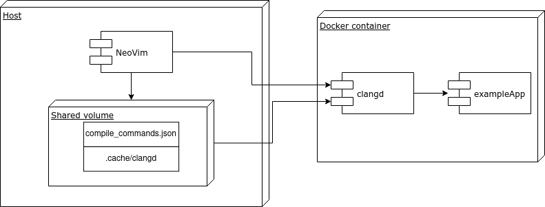
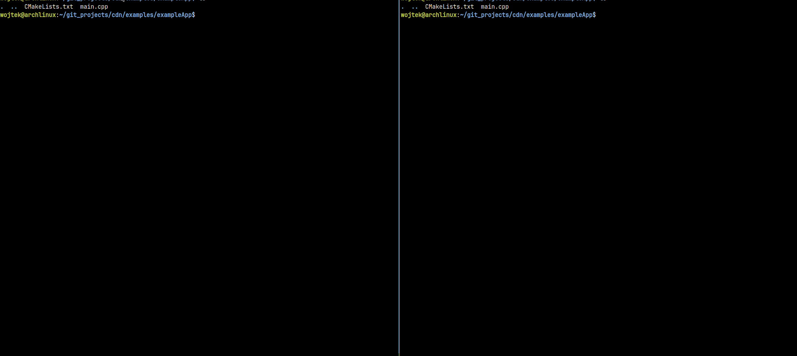

# Clangd - Docker - NeoVim

### The idea

The entire ecosystem is located in a docker container, on which the development environment (NeoVim) cannot be installed.

It is required that the container contains the clangd program.

NeoVim will run on the host computer and communicate with the clangd server, which will run in a container, so we can use autocomplete without installing dev environment on docker.

[The example](https://bleepcoder.com/languageclient-neovim/411959429/interaction-with-clangd-running-inside-docker-container) I followed, however, I could not translate it to [my neovim configuration](https://github.com/wojciechmadry/dotfiles/blob/main/nvim/init.lua).



### Example presentation



### Manual compilation and self-testing

1. Build docker image with example library [Host]

```sh
docker build -t example_docker -f Dockerfile .
```

2. Switch the default clangd command (`init.lua`) [Host]

```lua
require('lspconfig').clangd.setup {
 cmd = { "docker", "exec",  "-i", "example_container", "clangd", "--compile-commands-dir=<PATH_TO_REPO>/examples/exampleApp/build"},
}
```

3. cd into `exampleApp` directory and run [Host]

```sh
docker run --rm -v $(pwd):$(pwd) -w $(pwd) --name example_container -it example_docker bash
```

4. Build app [Docker container]

```sh
mkdir -p build
cd build
cmake -DCMAKE_EXPORT_COMPILE_COMMANDS=1 ..
make
```

5. Run NeoVim [Host]
